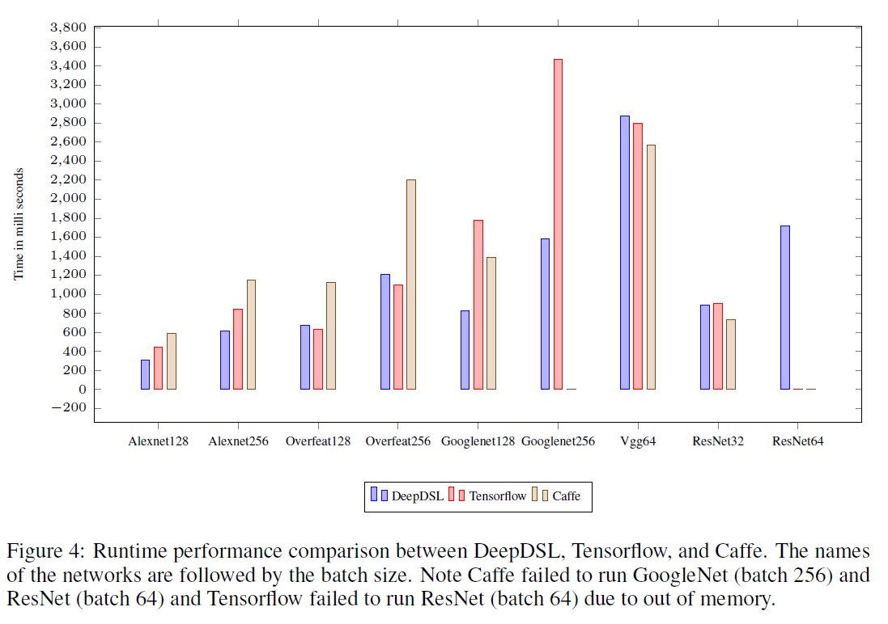
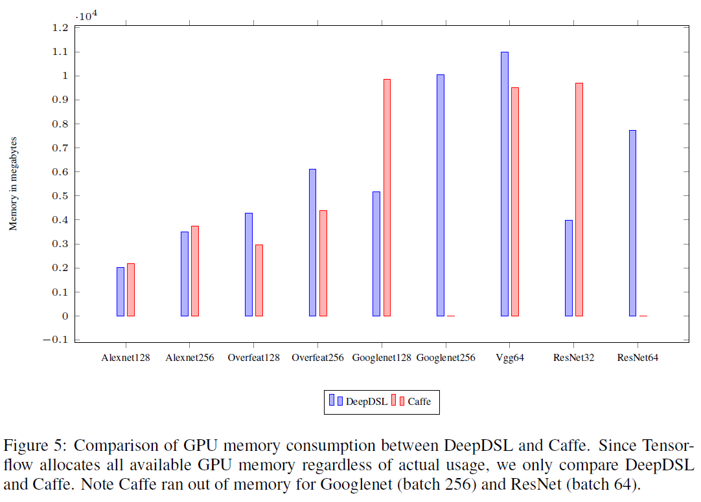

# Notice

As promised, we are now very happy to announce a major milestone release: DeepDSL v1.0. Also another very important decision we make is
to release the core Scala source code for reference in the hope that the system will become more popular and also facilitate advanced 
deep learning with more transparency. Please refer our papers below if you are using our code in academic research: 
- "DeepDSL: A Compilation-based Domain-Specific Language for Deep Learning" in proceedings of the International Conference on Learning Representations (ICLR 2017), Toulon, France. [pdf [DeepDSL]]
- "Design and Implementation of DeepDSL: A DSL for Deep Learning", Computer Languages, Systems & Structures, Volume 54, December 2018, Pages 39-70. [https://www.sciencedirect.com/science/article/pii/S1477842418300319]

Please read our LICENSE file and contact zhao.tian@gmail.com for commercial development and cooperation. 

# DeepDSL

DeepDSL is a domain specific language (DSL) embedded in Scala for writing deep learning network applications.

- DeepDSL program compiles into plain Java source program
- The compiled Java source program run on Nvidia GPU by leveraging [JCuda] to interact with the Nvidia CUDA library

## Performance Benchmark

Below we list the runtime and memory performance comparison between DeepDSL, Tensorflow, and Caffe with a single Nvidia Tesla K40c GPU. 



 

Please refer to our paper draft [DeepDSL] for full details. 

## Run DeepDSL compiled programs
- There are several compiled Java source program located at [src/main/java/deepdsl/gen/]. 
- These programs train and test on several well-known deep networks: Lenet, Alexnet, Overfeat, Googlenet, Vgg, and ResNet. 

### Maven Prerequisites:
- To build the project using Maven: You just need to install the latest [Apache Maven]
- To run test cases and compiled code for different networks, you also need to: 
  - have a [Nvidia CUDA] enabled GPU machine  
  - install 8.X version of [CUDA Toolkit 8.0] and [cuDNN 5] libraries
  - make sure that the cuDNN library is visible for Java. 
    On Windows, the path that contains the `cudnn64_5.dll` has to be added to the `PATH` environment variable. 
    On Linux, the path that contains the ` libcudnn.so.5` has be added to the `LD_LIBRARY_PATH`

### Maven Build (Need to be executed the below in the root folder of the project)
- Windows build: mvn -Pwin64 clean install
- Linux build: mvn -Plinux64 clean install
- OSX build: mvn -Posx64 clean install (This will be for trial purpose only as there're no CUDA based GPU on Mac systems yet)

### Maven Run (the below uses Alexnet as example, executions with other networks are similar)
After the previous Maven Build step, you can cd to the deepdsl-java folder and run the following based on your operating system:

- Windows build: mvn -Pwin64 exec:java -Dexec.mainClass="deepdsl.gen.Alexnet"
- Linux build: mvn -Plinux64 exec:java -Dexec.mainClass="deepdsl.gen.Alexnet"
- OSX build: mvn -Posx64 exec:java -Dexec.mainClass="deepdsl.gen.Alexnet"

### IDE notes
- It appears IntelliJ can handle the dependencies correctly once you import the Maven project or simply pull the latest code
- Eclipse, however, after importing Maven project, you may also need to right select deepdsl project -> Maven -> Update Project... -> Ok 
  to force refreshing the dependencies, if you have updated from previous build

## Data handling utils
There are two util Python scripts under the folder src/main/python (both should be run from the deepdsl project root folder).

- mnist_data_handler.py: download the mnist data and unzip to the `dataset/mnist` folder
     - to run: `python ../src/main/python/mnist_data_handler.py` (called in the `deepdsl-java` directory). This will pull and extract the mnist dataset to `dataset/mnist`
- imagenet_data_selector.py: to select given number of images of given number of categories from the original imagenet data
     - to run: `python src/main/python/imagenet_data_selector.py` and then follow the on-screen instructions to apply the desired parameters and run again
        - For example, `python imagenet_data_selector.py ~/data/ILSVRC2012_img_train ~/data/temp 5 50 0.3 0.2`, which selects from 5 categories (50 images per catetory) from ~/data/ILSVRC2012_img_train folder and stores selected images to ~/data/temp folder, where 30% are stored as validation dataset and 20% are stored as test dataset

### Default location for training and testing data
Each program assumes a location for the training and test data. 

- [Lenet.java] uses Mnist, which is assumed to be located at [dataset/mnist/](https://github.com/deepdsl/deepdsl/tree/master/deepdsl-java/dataset/mnist/) (please use the script described in the previous section to prepare the dataset).
- Other programs such as [Alexnet.java] use imagenet (as Lmdb database), which is assumed to be located at "[dataset/imagenet/]ilsvrc12_train_lmdb" for training data and "[dataset/imagenet/]ilsvrc12_val_lmdb" for testing data, where the image sizes are cropped to 224 x 224. Other image sizes should also work since we would randomly cropped the training images to the right size while cropping the testing images at center.
     - Users currently may use tools like [Caffe's imagenet script] `examples/imagenet/create_imagenet.sh` to create the lmdb data from the original Imagenet dataset. Please hang tight, we are adding our scripts soon so you don't have to resort to outside reources.
- For Lmdb data source, users may edit the call to [LmdbFactory].getFactory in the generated Java source to change the max number of training images and test images. The current default is 1000,000 and 10,000 respectively. 
- The training and testing all use the same batch size. 

## Adjust learning parameters
- At the start of each file, there are some parameters you can adjust such as learn_rate and moment, as well as training iterations and test iterations
- The batch size for Lenet is set at 500; for Alexnet, Overfeat, and Googlenet is 128; for Vgg and ResNet is set at 64
- At this time, if you want to change batch size, you may want to regenerate the Java source file. Directly editing the Java source might easily miss a few places

### <a name="default-loc"></a> Default location for trained parameters
Each program will save the trained model, the set of trained parameters (as serialized Java objects), into a default directory. 

- It will try to load saved parameters (if exist) from the same directory when you train the same program again next time
- For example, [Alexnet.java] will try to use the directory "[src/main/java/deepdsl/gen/]alexnet" 
- You can customize this in the source file directly.

## Generate Java source
You can generate Java source for a particular network by running the Scala test program [TestNetwork.scala]. While this is a Scala program, you can run it as a JUnit test to generate Java source code, the generated code will be written to [src/main/java/deepdsl/gen/]. 
You can run this directly from IDE, or cd to deepdsl-java folder and run from command line as the below after modifying the code and executing Maven build.

- e.g. Overfeat cuda code generation: mvn -Plinux64 test -Dtest=TestNetwork#testOverfeat_cuda (this will generate a new Overfeat.java that overwrites the existing one in [src/main/java/deepdsl/gen/]).

### Example: generate Lenet

```scala
    
    val K = 10 // # of classes 
    val N = 500; val C = 1; val N1 = 28; val N2 = 28 // batch size, channel, and x/y size
 
    // Specifying train dataSet. (code gen will also use this to find test dataSet)
    val y = Vec._new(Mnist, "label", "Y", N)              
    val x = Vec._new(Mnist, "image", "X", N, C, N1, N2)  
       
    // followings are tensor functions
    val cv1 = CudaLayer.convolv("cv1", 5, 20)       // convolution layer with kernel 5, stride 1, padding 0, and output channel 20
    val cv2 = CudaLayer.convolv("cv2", 5, 50)
    val mp = CudaLayer.max_pool(2)                  // max pooling with kernel 2 and stride 2
    val flat = Layer.flatten(4, 1)                  // flatten a 4-D tensor to 2-D: axis 0 - 3 becomes axis 0 and  axis 1-3
    val f = Layer.full("fc1", 500)                  // fully connected layer with output dimension 500
    val f2 = Layer.full("fc2", K)                   
    val softmax = CudaLayer.softmax                 
    val relu = CudaLayer.relu(2)                    // ReLU activation function (2-D)
      
    // o is a left-associative function composition operator: f o g o h == (f o g) o h  
    val network = f2 o relu o f o flat o mp o cv2 o mp o cv1 

    println(typeof(network))                        // typecheck the network and print out the tensor function type
    
    val x1 = x.asCuda                               // load x (images) to GPU memory
    val y1 = y.asIndicator(K).asCuda                // convert y (labels) to indicator vectors and load into GPU memory
    val c = (Layer.log_loss(y1) o softmax o network) (x1) // represent the log-loss of the training data
    val p = (Layer.precision(y1) o network) (x1)    // represent the accuracy of the test data
   
    val param = c.freeVar.toList                    // discover the list of training parameters
    
    // parameters: name, training iterations, test iterations, learn rate, momentum, weight decay, cropping (0 means none)
    val solver = Train("lenet", 100, 10, 0.01f, 0.9f, 0.0005f, 0)
    
    val loop = Loop(c, p, (x, y), param, solver)    // represent the training and testing loop
 
    runtimeMemory(loop.train)                       // print out the detailed memory consumption for one training loop
    parameterMemory(loop)                           // print out the parameter memory use
    workspaceMemory(loop.train)                     // print out the GPU (convolution) workspace use (only if you has Nvidia GPU)
    cudnn_gen.print(loop)                           // generate Java source code

```

## FAQ
- Where is the definition of the DeepDSL syntax?
     - All the available DSL constructs have been demonstrated in [TestNetwork.scala]. In addition, please refer to our Wiki page [DeepDSL layer syntax explanation][DeepDSL layer syntax] for detailed explanation for the layer syntax. 
- What should I do if I receive compilation errors in the TestNetwork.scala code after I upgrade code?
     - You can simply delete {your_home_folder}/.m2/repository/deepdsl/deepdsl-compile/0.1/deepdsl-compile-0.1.jar and rebuild.
- What if my maven build / execution process gives me "Caused by: jcuda.CudaException: CUDA_ERROR_UNKNOWN" like error?    
     - This means your installation of CUDA is not complete or correct. Please follow the [CUDA installation checking link] to verify and reinstall.
- I can build the project successfully (e.g. with "mvn -Plinux64 clean install") but I received "Caused by: org.fusesource.lmdbjni.LMDBException: No such file or directory" when I run "mvn -Plinux64 exec:java -Dexec.mainClass="deepdsl.gen.Alexnet"", what should I do?
     - Congratulations, you are actually very close to run the examples. The only thing you need is to have some Imagenet data in the LMDB format. You receive the attached error because you don't have the llmdb imagenet dataset in place. Please read the section "Default location for training and testing data" in this page for details on how to download the dataset and convert it to the Caffe lmdb format. Again, you need to put lmdb files to the assumed folder `dataset/imagenet/ilsvrc12_train_lmdb`.
- I can run the generated code, such as Alexnet128, however, I received exception as shown below when the execution finishes, what am I supposed to do?
 
    ```
    java.io.FileNotFoundException: src/main/java/deepdsl/gen/Alexnet128/cv1_B.ser (No such file or directory)
  	at java.io.FileOutputStream.open0(Native Method)
  	at java.io.FileOutputStream.open(FileOutputStream.java:270)
  	at java.io.FileOutputStream.<init>(FileOutputStream.java:213)
  	at java.io.FileOutputStream.<init>(FileOutputStream.java:101)
    ```
    
    ......
    
    
    ```
    java.io.FileNotFoundException: src/main/java/deepdsl/gen/Alexnet128/cv1_W.ser (No such file or directory)
  	at java.io.FileOutputStream.open0(Native Method)
  	at java.io.FileOutputStream.open(FileOutputStream.java:270)
  	at java.io.FileOutputStream.<init>(FileOutputStream.java:213)
  	at java.io.FileOutputStream.<init>(FileOutputStream.java:101)
    ```
    
    ......  

     - No worry. DeepDSL is designed to save your execution result automatically (Indeed, if you run the same program again, DeepDSL will 
     automatically pick up where you left off last time and start training the model from there!). You just need to let DeepDSL know where 
     to save! In the above example, the code is trying to store the trained model for Alexnet execution, therefore you need to create a 
     folder `src/main/java/deepdsl/gen/alexnet`� before you run the program, otherwise you lose it. Please refer to the 
     [Default location for trained parameters](#default-loc) section for more details.   

[JCuda]: <http://jcuda.org/>
[DeepDSL]: <https://openreview.net/pdf?id=Bks8cPcxe>

[TestNetwork.scala]: <https://github.com/deepdsl/deepdsl/blob/master/deepdsl-java/src/test/java/deepdsl/derivation/TestNetwork.scala>
[LmdbFactory]: <https://github.com/deepdsl/deepdsl/blob/master/deepdsl-java/src/main/java/deepdsl/tensor/LmdbFactory.java>

[src/main/java/deepdsl/gen/]: <https://github.com/deepdsl/deepdsl/tree/master/deepdsl-java/src/main/java/deepdsl/gen>

[Lenet.java]: <https://github.com/deepdsl/deepdsl/tree/master/deepdsl-java/src/main/java/deepdsl/gen/Lenet.java>
[Alexnet.java]: <https://github.com/deepdsl/deepdsl/tree/master/deepdsl-java/src/main/java/deepdsl/gen/Alexnet.java>


[dataset/imagenet/]: <>
[Caffe's imagenet script]: <https://github.com/BVLC/caffe/tree/master/examples/imagenet>

[Apache Maven]: <https://maven.apache.org/download.cgi>

[Nvidia CUDA]: <https://en.wikipedia.org/wiki/CUDA>

[CUDA Toolkit 8.0]: <https://developer.nvidia.com/cuda-downloads>
[cuDNN 5]: <https://developer.nvidia.com/cudnn>

[CUDA installation checking link]: <http://xcat-docs.readthedocs.io/en/stable/advanced/gpu/nvidia/verify_cuda_install.html>

[DeepDSL layer syntax]: <https://github.com/deepdsl/deepdsl/wiki/DeepDSL:-A-compilation-based-Domain-Specific-Language-for-Deep-Neural-Network>
